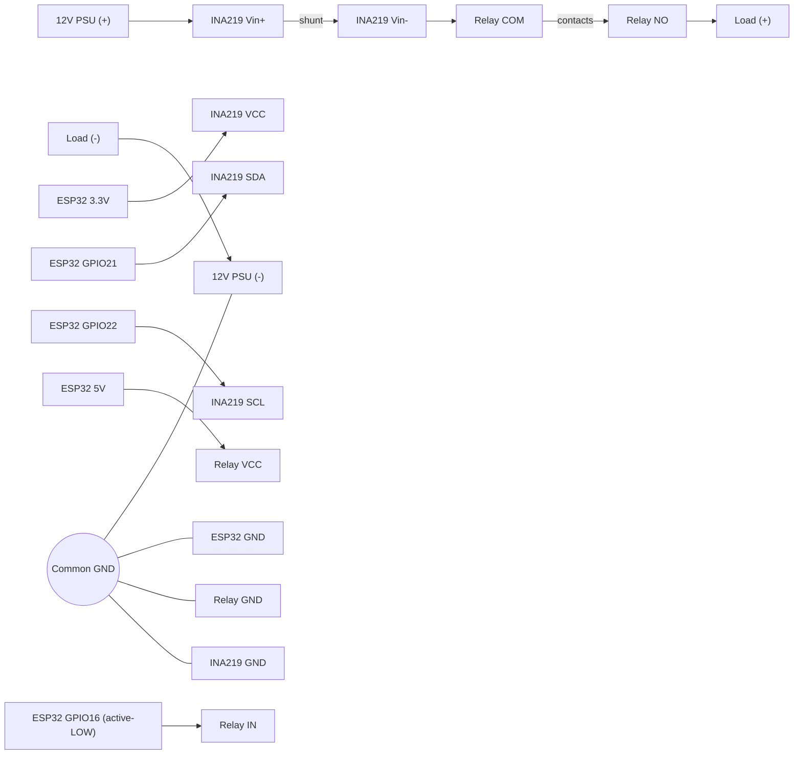

# Wiring: ESP32 + INA219 + Relay + 12 V Load

This documents how to wire the INA219 current/voltage sensor and a single-channel
relay module to the ESP32, switching a 12 V DC load while measuring its current.

## Voltage domains

| Domain      | Rail   | Used by                                        |
|-------------|--------|------------------------------------------------|
| Logic       | 3.3 V  | ESP32, INA219 chip supply (VCC), I2C bus        |
| Relay coil  | 5 V    | Relay module VCC (coil needs ~5 V to energize) |
| Load        | 12 V   | The switched load, measured through INA219      |

All grounds are tied together (common reference). The 12 V load current returns
through the 12 V supply ground.

## Power path (high-side sensing, measuring the switched load)

```
 12V PSU (+) ----> INA219 Vin+ --[shunt 0.1R]-- INA219 Vin- ----> Relay COM
                                                                     |
                                                              (contacts)
                                                                     |
                                                                Relay NO ----> LOAD (+)
 12V PSU (-) ---------------------------------------------------------------- LOAD (-)
```

- The INA219 sits **in series** on the 12 V positive rail, upstream of the relay COM.
- It only sees load current when the relay is closed (COM connected to NO).
- Relay contacts (COM/NO) switch the high side; they are isolated from the relay
  control side (VCC/IN/GND).

## Control + sense wiring (logic side)

```
        ESP32                         INA219 (breakout)
     +---------+                    +------------------+
     | 3V3     |------------------->| VCC (Vs)         |
     | GND     |------+------------>| GND              |
     | GPIO 21 |----->|             | SDA              |   (SDA -> GPIO21)
     | GPIO 22 |----->|             | SCL              |   (SCL -> GPIO22)
     |         |      |             | Vin+  <--- 12V(+) from PSU
     |         |      |             | Vin-  ---> Relay COM
     |         |      |             +------------------+
     |         |      |
     |         |      |                 Relay module
     |         |      |             +------------------+
     | 5V      |------|------------>| VCC  (coil 5 V)  |
     | GPIO 16 |------|------------>| IN   (active-LOW)|
     | GND ----+------+------------>| GND              |
     |         |                    | COM  <--- INA219 Vin-
     |         |                    | NO   ---> LOAD (+)
     |         |                    +------------------+
     +---------+

 Common ground: ESP32 GND, INA219 GND, Relay GND, and 12V PSU (-) all tied together.
```

### Pin summary

INA219:
- `VCC` -> ESP32 3.3 V   (chip logic supply, NOT 12 V)
- `GND` -> common ground
- `SDA` -> ESP32 GPIO 21
- `SCL` -> ESP32 GPIO 22
- `Vin+` -> 12 V PSU (+)
- `Vin-` -> Relay COM     (in series with the load)

Relay module:
- `VCC` -> 5 V            (coil supply)
- `GND` -> common ground
- `IN`  -> ESP32 GPIO 16  (active-LOW: drive LOW to energize)
- `COM` -> INA219 Vin-
- `NO`  -> LOAD (+)
- (`LOAD (-)` -> 12 V PSU (-))

## Notes / gotchas

1. **Relay VCC on 5 V is correct.** The coil typically needs ~5 V; 3.3 V often
   will not reliably pull it in.
2. **IN driven by a 3.3 V GPIO:** the ESP32 *drives* IN; the relay *reads* it.
   No voltage flows back into the GPIO. Use **active-LOW** logic so "on" pulls IN
   to 0 V (full opto current) and "off" leaves it at 3.3 V (below opto threshold).
   If the relay won't release, use an opto-isolated module with a separate
   JD-VCC/VCC jumper and power the input side from 3.3 V.
3. **INA219 bus-voltage limit** on the Adafruit breakout is 26 V, so 12 V is safe.
4. **Never connect 12 V to the INA219 VCC pin.** 12 V only goes to Vin+/Vin-.
5. **Common ground is required** for valid I2C communication and current
   measurement.
6. On esp32dev the default I2C pins are SDA=21, SCL=22; adjust if you call
   `Wire.begin(sda, scl)` with different pins.
```

## Mermaid diagram (rendered view)


